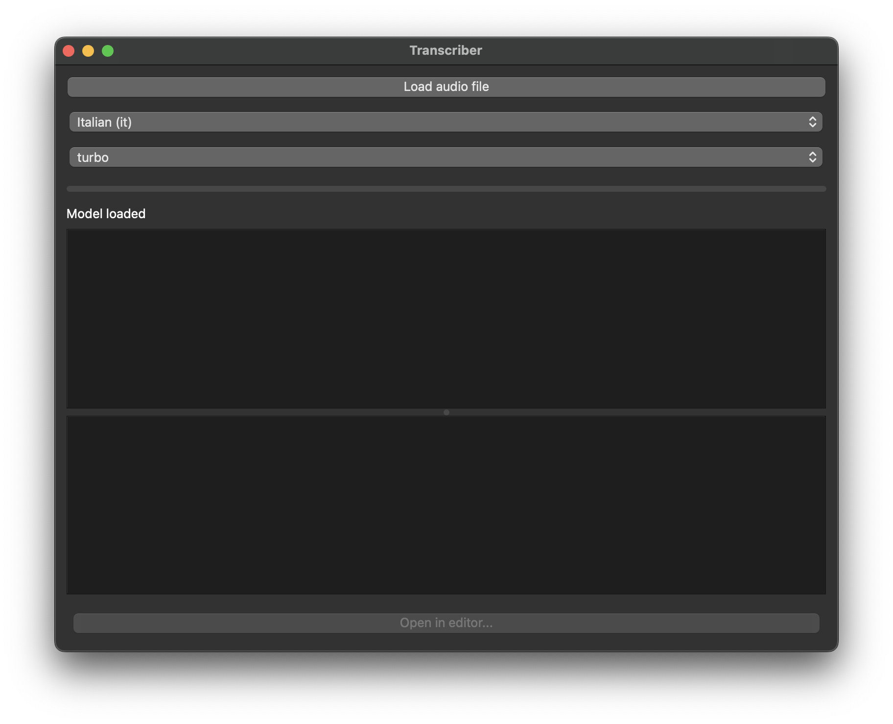

# Transcriber

Convert your audio files into text (event long ones)

## How to run

Click on [this link](https://github.com/damienzonly/Transcriber/archive/refs/heads/main.zip)

This will download a zip file containing the software, unzip it and click on the "Transcriber" program.

It takes some time the first time you run it

Enjoy

## Troubleshooting

On mac you may encounter a security warning.

To allow the program to run:
1. Go to System Settings
1. Privacy & Security
1. Scroll down until you see "Transcriber was blocked..."
1. Click `Open Anyway`
1. Another popup will appear asking for confirmation, click `Open`
1. Wait for the program to install and run